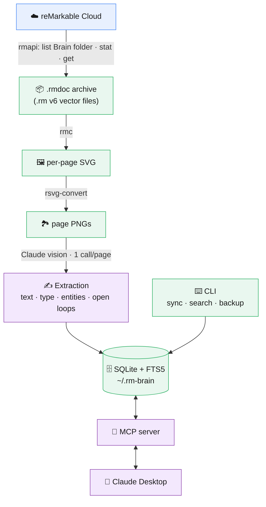

<div align="center">

# 🧠 rm-brain

**A local-first "second brain" for your handwritten reMarkable notebooks — searched through a normal Claude Desktop conversation.**

[](https://github.com/gabrielanhaia/remarkable-brain/actions/workflows/ci.yml)
[](./LICENSE)
[](https://nodejs.org)
[](./CONTRIBUTING.md)

[](https://xgabriel.com)
&nbsp;
[](https://www.buymeacoffee.com/gabrielanhaia)

**Built by [Gabriel Anhaia](https://xgabriel.com) · [☕ Buy me a coffee](https://www.buymeacoffee.com/gabrielanhaia)**

</div>

---

rm-brain quietly syncs the notebooks you drop into a **Brain** folder on your reMarkable,
transcribes and classifies the handwriting with the Claude API, and stores everything in a
local SQLite database. You then **search and explore your notes as an ordinary conversation
in Claude Desktop** — no separate app, no hosted service, using your existing Claude
subscription.

> **You:** *"What did I decide about the Ordio pricing model?"*
> **Claude:** *Pulls it from your notes and answers with receipts — notebook name, page
> number, date, and the scanned page.*

It's designed to feel less like a search box and more like a system that quietly organizes
itself and surfaces things you forgot about.

## Why it's different

- **Your handwriting, actually understood.** Claude vision transcribes messy handwriting and
  diagrams far better than built-in OCR, and classifies each page (journal / meeting / idea /
  decision / …), extracts people & projects, and flags open loops.
- **The interface is a conversation, not a dashboard.** Search happens inside Claude Desktop
  via [MCP](https://modelcontextprotocol.io) — you get a world-class chat UI for free.
- **Local-first and private by design.** The database, page images, and manifest never leave
  your machine. See [Privacy](#-privacy--safety).
- **Answers with receipts.** Every answer cites the notebook, page number, and date, and can
  show you the scanned page — so you verify, not trust blindly.

## How it works



reMarkable notebooks are stored as proprietary `.rm` v6 vector files (not PDFs), so pages are
rendered with [`rmc`](https://github.com/ricklupton/rmc) + `rsvg-convert`. See
[ARCHITECTURE.md](./ARCHITECTURE.md) for the full design.

## 🔒 Privacy & safety

- **Local-first, always.** `db.sqlite`, page images, and the manifest live in one folder
  (`~/.rm-brain` by default) and never leave your machine as a whole.
- **The only things that ever go over the network** are (a) individual page images sent to the
  Claude API during `sync`, and (b) individual queries + retrieved snippets sent through MCP
  while you search in Claude Desktop.
- **Opt-in by folder.** Nothing is indexed unless you put the notebook in your Brain folder.
- **The folder is the source of truth.** Remove a notebook from it and the next `sync` prunes
  it from your local index — pages and images included.
- **Hard exclusion always wins.** A notebook whose name matches `/^\./`, `/private/i`, or
  `/noindex/i` is skipped entirely, even inside the Brain folder.
- **Read-only cloud access.** rm-brain only ever *reads* from reMarkable (`list` / `stat` /
  `get`); it never uploads or modifies anything.
- **No telemetry.** rm-brain phones home to nobody. See [SECURITY.md](./SECURITY.md).

## Prerequisites

> ✅ **No jailbreak, rooting, developer mode, or SSH hacks — ever.** rm-brain works entirely
> through reMarkable's **official cloud sync** (via `rmapi`). Your tablet stays completely stock,
> stock firmware, and under warranty. Nothing is installed on or modified on the device.

| Tool | Why | Install |
| --- | --- | --- |
| **Node.js 20+** | runtime | [nodejs.org](https://nodejs.org) |
| **rmapi** (ddvk `sync15` build) | reMarkable Cloud CLI | [ddvk/rmapi releases](https://github.com/ddvk/rmapi/releases) — reMarkable's newer sync protocol returns HTTP 410 with older builds |
| **rmc** | renders `.rm` v6 pages | `pipx install rmc` |
| **librsvg** (`rsvg-convert`) | SVG → PNG | `brew install librsvg` |
| **Anthropic API key** | handwriting extraction (used only during `sync`) | [console.anthropic.com](https://console.anthropic.com) |

## Quickstart

```bash
# 1. Install
git clone https://github.com/gabrielanhaia/remarkable-brain.git
cd remarkable-brain
npm install && npm run build
npm link            # puts `rm-brain` on your PATH

# 2. Guided setup (pairs rmapi, saves your API key, wires Claude Desktop)
rm-brain setup

# 3. On the tablet: create a "Brain" folder, move a notebook in, let it sync
rm-brain sync

# 4. Fully quit & reopen Claude Desktop, then just ask it about your notes
```

The `setup` wizard checks your tools, pairs rmapi, **prompts for your API key once and saves
it** (to `~/.rm-brain/config.json`, chmod 600 — no re-`export` needed), helps you pick the
Brain folder, offers to run the first sync, and can write your Claude Desktop config
automatically. Re-run it anytime — it's idempotent.

## Usage

Once a notebook is indexed and Claude Desktop is connected, just talk to Claude:

- *"What are my open loops?"* / *"What did I forget to follow up on?"*
- *"Search my notes for the Falcon pricing decision."*
- *"How has my thinking on the onboarding flow evolved?"* (entity timeline)
- *"Show me the page where I sketched the architecture."*

### CLI reference

| Command | What it does |
| --- | --- |
| `rm-brain setup` | Interactive setup wizard (start here) |
| `rm-brain sync` | Pull Brain-folder notebooks, render, extract, index |
| `rm-brain reindex` | Re-extract all indexed pages (after a prompt/model change) |
| `rm-brain search "<query>"` | Full-text search from the terminal |
| `rm-brain list` | Show indexed notebooks and page counts |
| `rm-brain info` | Where the data lives + stats |
| `rm-brain backup [dest]` | Write a portable `.tar.gz` of the whole index |
| `rm-brain exclude "<name>"` / `include "<name>"` | Exclude (purges) / re-include a notebook |
| `rm-brain purge` | Delete the entire local index |
| `rm-brain doctor` | Check dependencies |
| `rm-brain mcp` | Start the MCP server (Claude Desktop runs this) |

### Configuration

All config is via environment variables (env wins) or the saved store (`~/.rm-brain/config.json`).

| Env var | Default | Purpose |
| --- | --- | --- |
| `RM_BRAIN_HOME` | `~/.rm-brain` | Where all local data lives |
| `RM_BRAIN_FOLDER` | `/Brain` | reMarkable folder whose notebooks get indexed (case-insensitive) |
| `RMAPI_BIN` | `rmapi` | Path/name of the rmapi binary (ddvk sync15 build) |
| `RMC_BIN` | `rmc` | Path/name of the rmc renderer |
| `RSVG_BIN` | `rsvg-convert` | Path/name of rsvg-convert |
| `ANTHROPIC_API_KEY` | — | Required only for `sync` (extraction) |
| `ANTHROPIC_MODEL` | `claude-sonnet-5` | Vision model for extraction |

### Portability & backup

The whole index is one self-contained folder, so:

- **Back up:** `rm-brain backup [dest.tar.gz]`, or just copy `~/.rm-brain`.
- **Roam / auto-backup:** point `RM_BRAIN_HOME` at a Dropbox/iCloud/Syncthing folder.
- **Restore:** extract the archive anywhere and point `RM_BRAIN_HOME` at it.

## Troubleshooting

<details>
<summary><b>rmapi says "failed to build documents tree … status 410"</b></summary>

Your reMarkable account is on the newer sync protocol. Use the
[**ddvk `sync15` build**](https://github.com/ddvk/rmapi/releases) of rmapi (a release binary is
easiest), not the original `juruen/rmapi`. Then re-run `rm-brain doctor`.
</details>

<details>
<summary><b>Claude Desktop gives empty results even though the note exists</b></summary>

Claude Desktop launches the MCP server once at startup and keeps it running. After any
`rm-brain` update, **fully quit Claude Desktop (⌘Q, not just close the window)** and reopen it
so it reloads the server.
</details>

<details>
<summary><b>Claude answers from the calendar/memory instead of my notes</b></summary>

Add a one-line personal instruction in **Claude Desktop → Settings → Profile / Custom
Instructions**: *"I keep my handwritten notes in rm-brain. For anything about my tasks, plans,
or notes, use the rm-brain tools first."* The server also ships proactive instructions, but a
personal instruction is the most reliable nudge.
</details>

<details>
<summary><b>My notebook isn't being indexed</b></summary>

Make sure it's **inside the Brain folder** (case-insensitive) and that the tablet has **synced
to the cloud** (Wi-Fi on). Then run `rm-brain sync`. Notebooks named `private`/`noindex`/dotted
are skipped by design.
</details>

<details>
<summary><b>I changed the extraction prompt / model — old pages didn't update</b></summary>

A normal `sync` skips pages whose image is unchanged. Run `rm-brain reindex` to re-extract
everything.
</details>

## Roadmap / not in v1 (on purpose)

No vector search / embeddings (FTS5 keyword search only), no notifications or daily digests, no
summary dashboard, no web UI. This stays a tool you reach for, not one that reaches for you.
Ideas and PRs welcome — see [CONTRIBUTING.md](./CONTRIBUTING.md).

## Contributing

Contributions are very welcome! Please read [CONTRIBUTING.md](./CONTRIBUTING.md) to get set up,
and [CODE_OF_CONDUCT.md](./CODE_OF_CONDUCT.md). Security issues: [SECURITY.md](./SECURITY.md).

## 💛 Support

If rm-brain is useful to you, consider supporting development — it genuinely helps and keeps the
project going:

<p align="center">
  <a href="https://www.buymeacoffee.com/gabrielanhaia">
    
  </a>
  &nbsp;&nbsp;
  <a href="https://xgabriel.com">
    
  </a>
</p>

You can also ⭐ star the repo — it helps others discover it.

## License

[MIT](./LICENSE) © [Gabriel Anhaia](https://xgabriel.com)

<div align="center">
  <sub>Built by <a href="https://xgabriel.com">Gabriel Anhaia</a> · ☕ <a href="https://www.buymeacoffee.com/gabrielanhaia">Buy me a coffee</a></sub>
</div>
